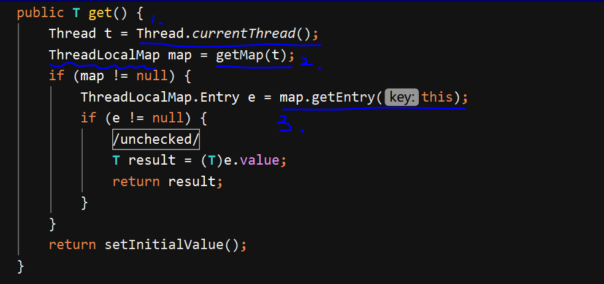

#### ThreadLocal 

---
##### 2种使用场景
1. 每个线程各自拥有一个副本
2. 在同一线程中的调用链间传递数据

---
##### ThreadLocalMap
1. key -> threadLocal
2. value -> any object
3. 1. 在ThreadLocal中获取当前线程后，
   2. 再获取当前线程的成员变量ThreadLocalMap，
   3. 再把自己（this/ThreadLocal)当作key传入获取相应的副本。

4. get方法是懒加载: 第一次get时map为null，走的是setInitialValue方法

---
##### Thread,ThreadLocalMap,ThreadLocal三者的关系：
某个线程对象中有一个ThreadLocalMap,该Map以不同的ThreadLocal作为key来存储不同的副本。

---
##### OOM
引用链: Thread->ThreadLocalMap->Entry->Value
当线程处于线程池中时，线程不会被销毁，因而对于Value的强引用链一直存在，如果Value一直增加则会造成内存溢出。

solution: 主动调用remove方法，删除对应Entry对象。

