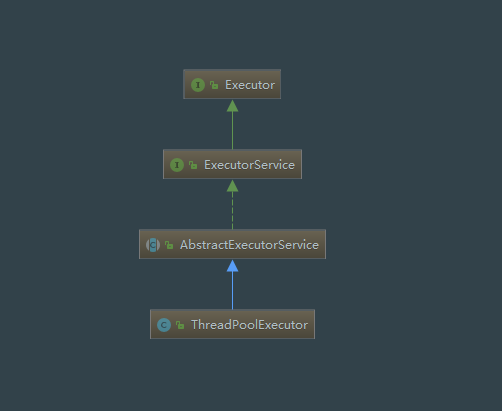

#### ThreadPool

---
1. 继承关系：Executor<-ExecutorService<-AbstractExecutorService<-ThreadPoolExecutor
2. 工具类：Executors



---
##### 5 run state 
Described in ThreadPoolExecutor.java :
```
RUNNING:  Accept new tasks and process queued tasks
SHUTDOWN: Don't accept new tasks, but process queued tasks
STOP:     Don't accept new tasks, don't process queued tasks, and interrupt in-progress tasks
TIDYING:  All tasks have terminated, workerCount is zero, the thread transitioning to state TIDYING will run the terminated() hook method
TERMINATED: terminated() has completed

1.RUNNING -> SHUTDOWN
   On invocation of shutdown(), perhaps implicitly in finalize()
2.(RUNNING or SHUTDOWN) -> STOP
   On invocation of shutdownNow()
3.SHUTDOWN -> TIDYING
   When both queue and pool are empty
4.STOP -> TIDYING
   When pool is empty
5.TIDYING -> TERMINATED
   When the terminated() hook method has completed
```

---
**线程池的钩子方法**： beforeExecute(),afterExecute(),在每个任务开始前后执行。

---
**线程复用的原理**
ThreadPoolExecutor的内部类Worker实现了Runnable类，重写的run方法中是一个while循环，
在循环的条件中判断队列中是否还可以得到新的任务，如果有就将调用新任务的run方法。

---
**4中拒绝策略**
AbortPolicy,DiscardPolicy,DiscardOldestPolicy,CallerRunsPolicy
